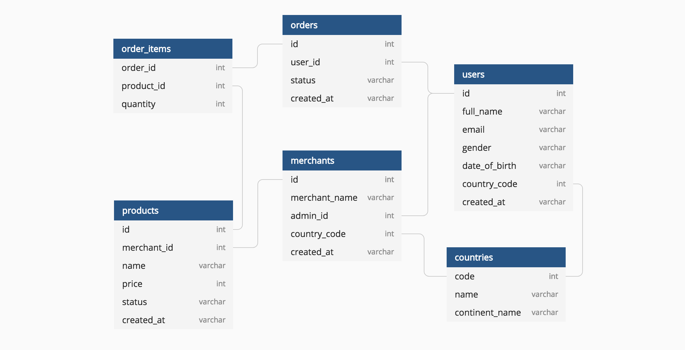

# Store APP - ASP.NET MVC
Store App is a application that allows you to manage the products, merchants, orders, users, and countries of a store. It is a project developed in ASP.NET MVC with C# and MariaDB. It uses Entity Framework Core as ORM and Bootstrap for the frontend.

To execute the project, you must have installed:
- Docker and Docker Compose
- .NET 7
- Visual Studio 2022

To start the database, you must run the command:
```bash
docker-compose up
```

It will start a MariaDB database on port 3307.

With the databases ready, the scripts for creating tables in the `scripts` folder must be executed.
The database is governed by the following model:


This project uses logical deletion, so the tables have a column called `state` that indicates if the record is deleted or not.

This is a MVC project, so it must be executed from Visual Studio 2022. The project is configured to run on port 5014.

It has two types of controllers:
- MVC controllers: They are in the `Controllers` folder. They are responsible for managing the views and the data that is sent to them.
- API controllers: They are in the `Controllers/REST` folder. They are responsible for managing the data that is sent to them and returning it in JSON format.

The endpoints of the API controllers are:
- Countries:
	- GET /api/CountriesControllerREST: Returns all countries.
	- GET /api/CountriesControllerREST/{id}: Returns the country with the specified id.
	- POST /api/CountriesControllerREST: Creates a new country.
	- PUT /api/CountriesControllerREST/{id}: Updates the country with the specified id.
	- DELETE /api/CountriesControllerREST/{id}: Deletes the country with the specified id.
- Users:
	- GET /api/UsersControllerREST: Returns all users.
	- GET /api/UsersControllerREST/{id}: Returns the user with the specified id.
	- POST /api/UsersControllerREST: Creates a new user.
	- PUT /api/UsersControllerREST/{id}: Updates the user with the specified id.
	- DELETE /api/UsersControllerREST/{id}: Deletes the user with the specified id.

- Merchants:
	- GET /api/MerchantsControllerREST: Returns all merchants.
	- GET /api/MerchantsControllerREST/{id}: Returns the merchant with the specified id.
	- POST /api/MerchantsControllerREST: Creates a new merchant.
	- PUT /api/MerchantsControllerREST/{id}: Updates the merchant with the specified id.
	- DELETE /api/MerchantsControllerREST/{id}: Deletes the merchant with the specified id.

- Orders:
	- GET /api/OrdersControllerREST: Returns all orders.
	- GET /api/OrdersControllerREST/{id}: Returns the order with the specified id.
	- POST /api/OrdersControllerREST: Creates a new order.
	- PUT /api/OrdersControllerREST/{id}: Updates the order with the specified id.
	- DELETE /api/OrdersControllerREST/{id}: Deletes the order with the specified id.

- Products:
	- GET /api/ProductsControllerREST: Returns all products.
	- GET /api/ProductsControllerREST/{id}: Returns the product with the specified id.
	- POST /api/ProductsControllerREST: Creates a new product.
	- PUT /api/ProductsControllerREST/{id}: Updates the product with the specified id.
	- DELETE /api/ProductsControllerREST/{id}: Deletes the product with the specified id.

- Order Items:
	- GET /api/OrderItemsControllerREST: Returns all order items.
	- GET /api/OrderItemsControllerREST/{orderId}/{productId}: Returns the order item with the specified order id and product id.
	- POST /api/OrderItemsControllerREST: Creates a new order item.
	- PUT /api/OrderItemsControllerREST/{orderId}/{productId}: Updates the order item with the specified order id and product id.
	- DELETE /api/OrderItemsControllerREST/{orderId}/{productId}: Deletes the order item with the specified order id and product id.
